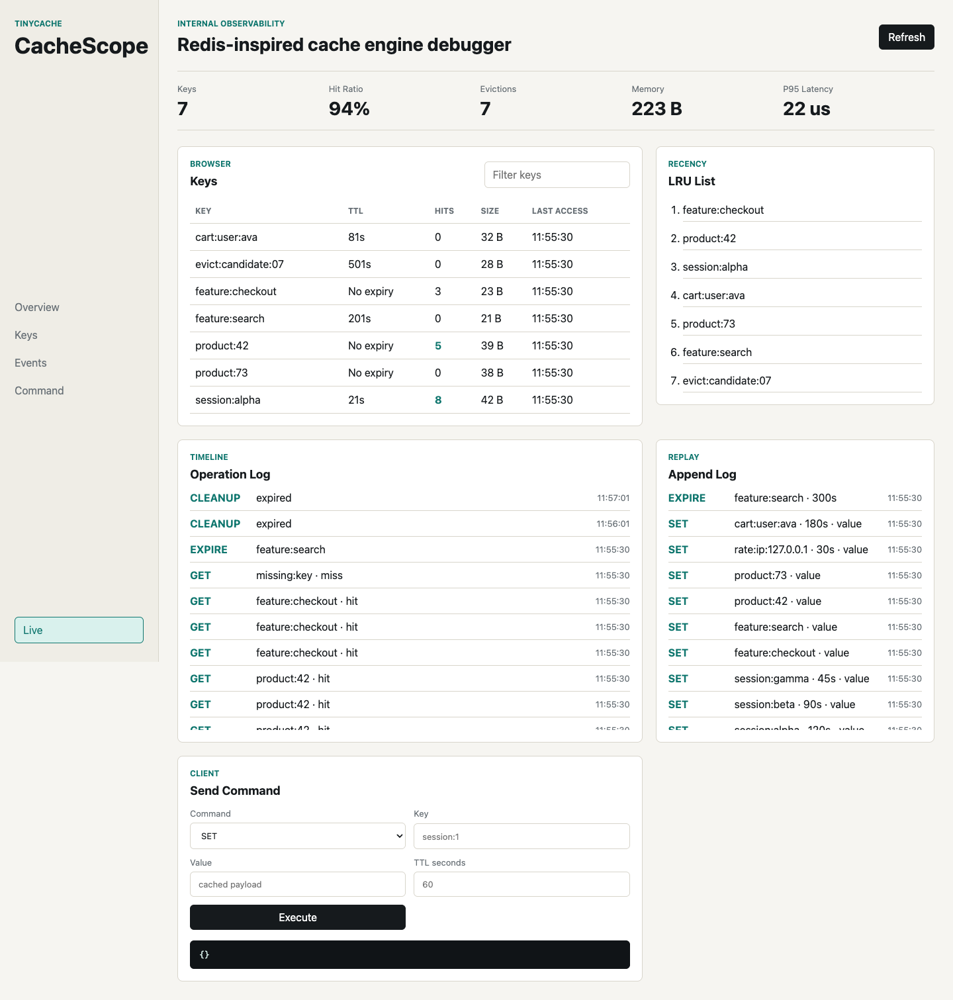

# TinyCache

TinyCache is a Redis-inspired in-memory cache engine with HTTP commands and debugger-friendly observability endpoints. V1 focuses on the core cache internals that CacheScope will visualize later: TTL expiration, LRU eviction, memory/key accounting, command metrics, event logs, and debug snapshots.



## Features

- HTTP cache commands: `SET`, `GET`, `DEL`, `EXPIRE`, `TTL`.
- TTL cleanup with lazy expiration and a background sweeper.
- LRU and LFU eviction modes.
- Metrics with hit ratio, memory estimate, evictions, and latency percentiles.
- Debug endpoints for keys, LRU order, events, replay records, and one-call UI hydration.
- JSON snapshot persistence and append-only mutation logging.
- CacheScope static dashboard served by the Go server.
- Demo seeder and benchmark CLI.

## Run

```sh
go run ./cmd/tinycache --addr :8080
```

Optional flags:

```sh
go run ./cmd/tinycache \
  --addr :8080 \
  --max-keys 1000 \
  --cleanup-interval 1s \
  --event-log-size 1000 \
  --eviction-policy lru \
  --snapshot-path /private/tmp/tinycache.snapshot.json \
  --aof-path /private/tmp/tinycache.aof \
  --ui-dir web/cachescope
```

## Commands

```sh
curl -X POST http://localhost:8080/command/set \
  -H 'Content-Type: application/json' \
  -d '{"key":"name","value":"tiny","ttlSeconds":60}'

curl 'http://localhost:8080/command/get?key=name'
curl 'http://localhost:8080/command/ttl?key=name'

curl -X POST http://localhost:8080/command/expire \
  -H 'Content-Type: application/json' \
  -d '{"key":"name","ttlSeconds":120}'

curl -X DELETE 'http://localhost:8080/command/del?key=name'
```

## Debug Endpoints

- `GET /metrics` returns aggregate counters, hit ratio, key count, memory estimate, latency summaries, evictions, and uptime.
- `GET /debug/keys` returns key metadata only. Supports `filter`, `sort`, `desc`, and `limit`.
- `GET /debug/summary` returns metrics, keys, LRU order, and recent events in one response.
- `GET /debug/lru` returns keys from most-recently-used to least-recently-used.
- `GET /debug/events` returns the bounded recent operation and eviction log.
- `GET /debug/events/stream` streams live snapshots for CacheScope over server-sent events.
- `GET /debug/replay` returns append-only log records when `--aof-path` is configured.
- `POST /admin/snapshot` writes a JSON snapshot when `--snapshot-path` is configured.
- `GET /healthz` returns server health.

## CacheScope

Run TinyCache with the static UI enabled:

```sh
make run
```

Then open `http://localhost:8080`.

Useful Make targets:

```sh
make fmt
make test
make race
make bench
make bench-cli
make run
make demo
make smoke
```

Sample HTTP requests are available in `examples/tinycache.http`.

For a screenshot-ready demo:

```sh
make run MAX_KEYS=10
make demo
make screenshot
```

The screenshot is written to `docs/assets/cachescope.png`.

## Test

```sh
go test ./...
go test -race ./...
go test -bench=. ./internal/cache
```
